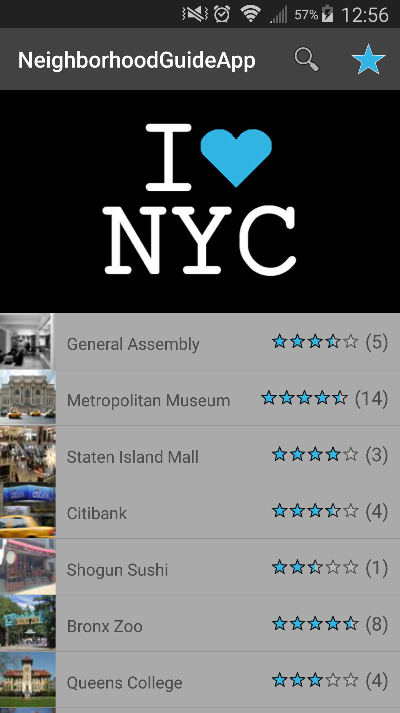
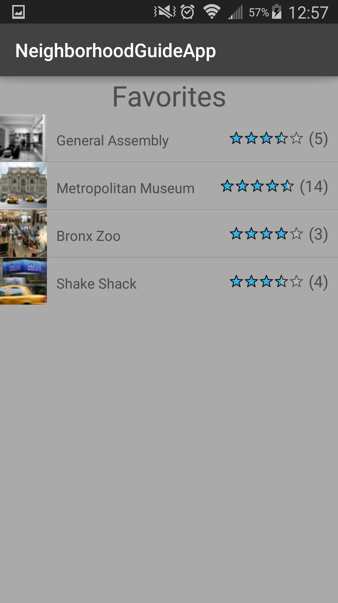

# Project #2: Neighborhood Guide App

#### Overview

This app includes a SQLite database of locations that can be searched for by name, type, and borough. The user can save a location to their favorites. The favorites list is easily accessible by clicking the star button. The user is able to write reviews which are then saved in the database. The average rating and number of reviews is updated accordingly. 

---

#### Features

* Search a place by name, type, borough
* Add a place to favorites
* Add reviews to a place
* See average rating and number of reviews for a place

#### Screenshots

  

 

  

 

#### Bugs

There is an issue with storing and retrieving images from the database. In the future I would take images from the web and store only a few images in the drawable folder.